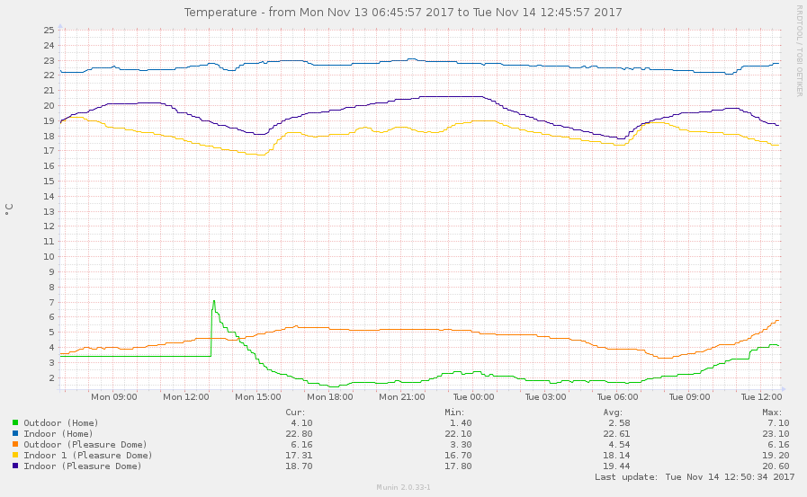
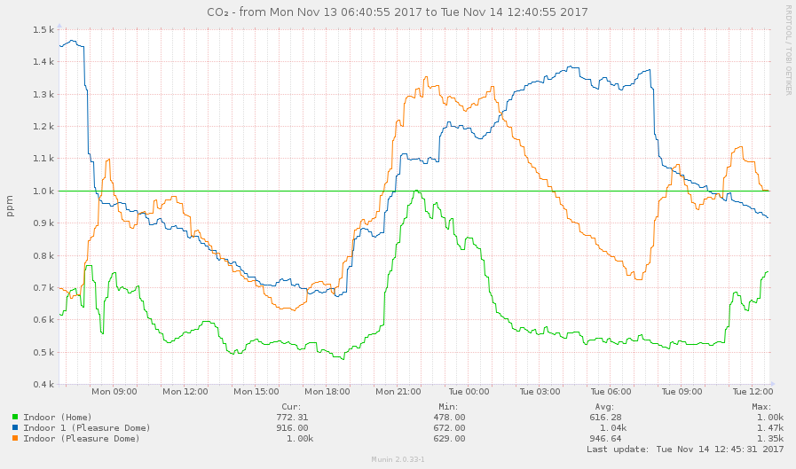
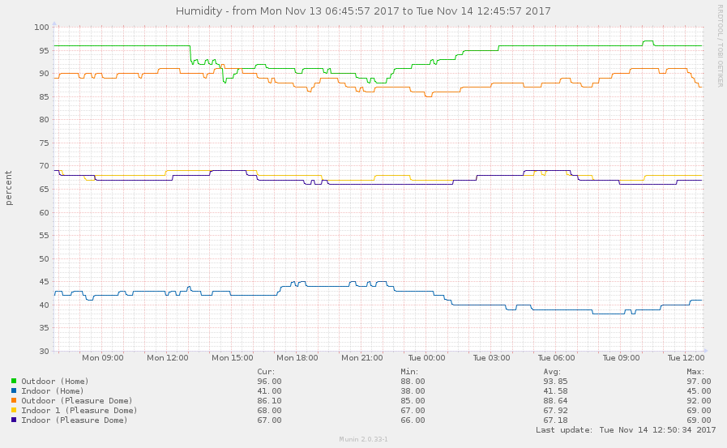
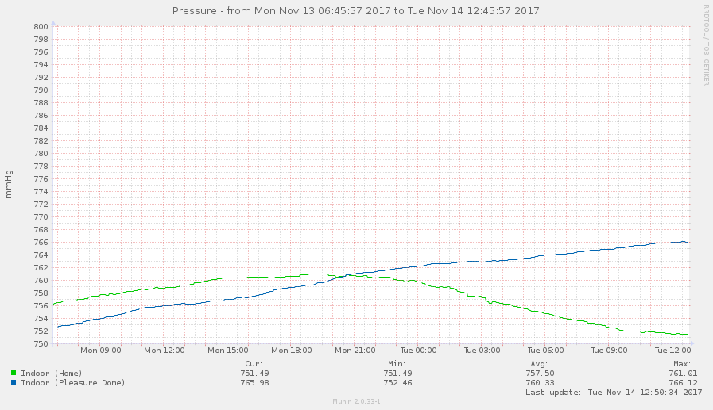
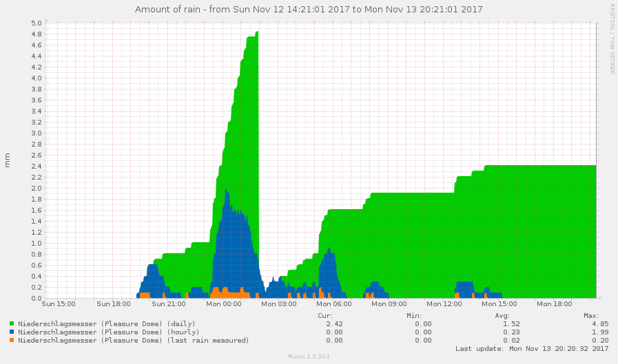

# NetAtmo plug-in for Munin v3.0

## Dependencies
NetAtmo Weather Station  
GoLang 1.x  
Munin-node 2.x

## Installation

Open https://dev.netatmo.com and create first application, then:

~~~sh
go get -u github.com/exzz/netatmo-api-go
go get -u github.com/BurntSushi/toml
git clone https://github.com/NightMan-1/netatmo-munin-go
cd netatmo-munin-go
chmod +x install.sh
./install.sh
#service munin-node restart
~~~

## Sample data

## Credits
Copyright © 2017 [Sergey Gurinovich](mailto:sergey@fsky.info).
